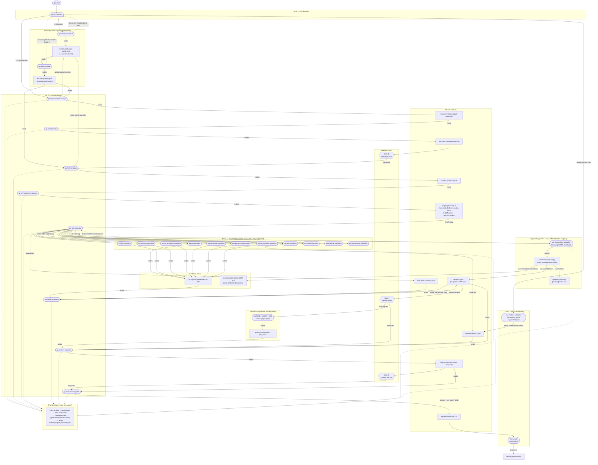

# Agent Workflow Diagram

> Visual reference for the complete Aegis agent execution pipeline.
> Rendered SVG: [D03-agent-workflow-diagram.svg](./D03-agent-workflow-diagram.svg)
> See [HANDBOOK/03](../HANDBOOK/03-architecture.md) for narrative architecture and [HANDBOOK/06](../HANDBOOK/06-agents.md) for the full agent roster.

## How to read this diagram

- Rounded rectangles `( )` = agents
- Sharp rectangles `[ ]` = file artifacts
- Diamonds `{ }` = human gates
- Subgraphs = tier / category groupings
- Arrows = data flow (labelled: writes / reads / dispatch / emits)

## Full workflow diagram



## Key flows explained

1. **Discovery** (two-event barrier): `qa-context-scanner` writes `target-profile.json` (incl. `sourceInventory`) and emits `DiscoveryStepComplete {scan}`; `qa-web-explorer` then writes `discovery-report.json` and emits `DiscoveryStepComplete {explore}`. The orchestrator advances only when **both** events are present (`Promise.all([scan, explore])`).
2. **Planning chain**: `qa-requirements-analyst` (source-grounded against `sourceInventory`) → `qa-test-planner` → **Gate 1** → `qa-test-designer` → `qa-environment-engineer` (writes `playwright.config.ts` with `screenshot:'always'` / `video` / `trace`).
3. **Execution order**: `qa-test-executor` runs `qa-exploratory-specialist` FIRST (Playwright MCP, blocking) → then scripted specialists (Playwright CLI, ≤4 parallel). Exploratory findings feed the scripted briefs.
4. **Sandbox flow**: exploratory scratch → `sandbox/{date}-{slug}/`. At session end: covered observations → `reports/exploratory/`; uncovered defects → `runs/{runId}/defects/` + `runs/{runId}/evidence/{DEF-ID}/`; then `completeSandbox()` deletes the sandbox.
5. **Closure**: `qa-defect-manager` (triages scripted + EXP-type defects) → **Gate 2** → compliance (parallel) + `qa-closure-reporter` (reads `reports/metrics/`, writes `reports/closure/closure.{md,json}`) → **Gate 3** → `qa-executive-reporter` (PDFs in `reports/executive/`).
6. **SPV loop**: every worker writes a work-report; its dispatcher (orchestrator for Tier-1, test-executor for Tier-2) dispatches the paired SPV, reads the verdict, and calls `pipeCorrectiveInstruction()` to append a lesson on any non-pass verdict. SPVs are read-only and cannot write lessons themselves.
7. **Metrics**: `qa-metrics-collector` is dispatched at run start, tails `events.jsonl`, and writes intermediate rollups to `reports/metrics/` on every phase completion — so closure-reporter can read them with no finalize-wait.
8. **Self-improvement**: `qa-curator` runs after Gate 3 and writes proposals to `pending-promotions/`.

## Regenerating the SVG

```bash
npx @mermaid-js/mermaid-cli mmdc \
  -i docs/D03-agent-workflow-diagram.md \
  -o docs/D03-agent-workflow-diagram.svg
# or:
pnpm diagram
```

## See also

- [HANDBOOK/03-architecture.md](../HANDBOOK/03-architecture.md)
- [HANDBOOK/04-stlc-walkthrough.md](../HANDBOOK/04-stlc-walkthrough.md)
- [HANDBOOK/06-agents.md](../HANDBOOK/06-agents.md)
- [docs/D13-spv-review-pattern.md](./D13-spv-review-pattern.md)
