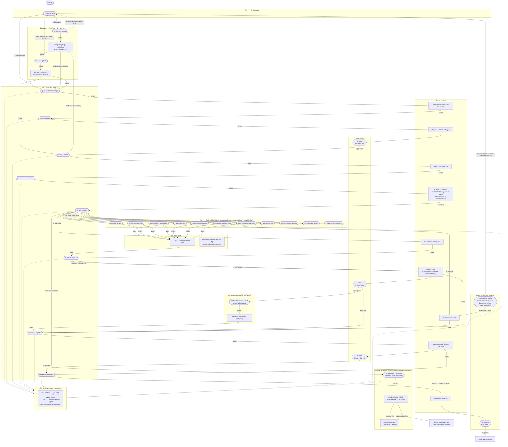

# Agent Workflow Diagram

> Visual reference for the complete Aegis agent execution pipeline.
> Rendered SVG: [D03-agent-workflow-diagram.svg](./D03-agent-workflow-diagram.svg)
> See [HANDBOOK/03](../HANDBOOK/03-architecture.md) for narrative architecture and [HANDBOOK/06](../HANDBOOK/06-agents.md) for the full agent roster.

## How to read this diagram

- Rounded rectangles `( )` = agents
- Sharp rectangles `[ ]` = file artifacts
- Diamonds `{ }` = human gates
- Subgraphs = tier / category groupings
- Arrows = data flow (labelled: writes / reads / dispatch / emits)

## Full workflow diagram


```mermaid
flowchart TD
    Start(["/qa-start"]) --> Orchestrator

    subgraph Tier0["Tier 0 — Orchestrator"]
        Orchestrator(["qa-orchestrator"])
    end

    subgraph CrossCutting["Cross-Cutting (on demand)"]
        MetricsCollector(["qa-metrics-collector<br/>before Closure-draft and Executive, writes reports/metrics/"])
        Curator(["qa-curator<br/>post Gate 3"])
    end

    subgraph Discovery["Discovery Phase (two-event barrier)"]
        Scanner(["qa-context-scanner"])
        WebExplorer(["qa-web-explorer"])
        TargetProfile["runs/{runId}/target-profile.json<br/>(+ sourceInventory)"]
        DiscoveryReport["discovery-report.json<br/>tests/pages/{url-path}/"]
    end

    subgraph Tier1["Tier 1 — Phase Agents"]
        RA(["qa-requirements-analyst"])
        Planner(["qa-test-planner"])
        Designer(["qa-test-designer"])
        EnvEng(["qa-environment-engineer"])
        Executor(["qa-test-executor"])
        DefectMgr(["qa-defect-manager"])
        ClosureRep(["qa-closure-reporter"])
        ExecRep(["qa-executive-reporter"])
    end

    subgraph Artifacts["Phase Artifacts"]
        AmbReport["requirements/ambiguity-report.json"]
        Plan["plan.json + risk-register.json"]
        Cases["cases/*.json + rtm.json"]
        PlaywrightCfg["playwright.config.ts<br/>(screenshot:always, video, trace)<br/>tests/fixtures/ + tests/factories/"]
        ExecSummary["execution-summary.json"]
        Defects["defects/*.json<br/>(confirmed from failures and candidates)"]
        MetricsFiles["reports/metrics/*.json"]
        ClosureFiles["reports/closure/closure.{md,json}"]
        ExecReports["reports/executive/*.pdf"]
    end

    subgraph Gates["Human Gates"]
        Gate1{{"Gate 1<br/>Plan Approval"}}
        Gate2{{"Gate 2<br/>Defect Triage"}}
        Gate3{{"Gate 3<br/>Closure Sign-off"}}
    end

    subgraph Explore["Explore phase (MCP — story sessions before planning)"]
        Exploratory(["qa-exploratory-specialist<br/>Playwright MCP mandatory"])
        Sandbox["sandbox/{date}-{slug}/<br/>notes + evidence (scratch)"]
        SessionNotes["reports/exploratory/<br/>{session}-notes.md"]
    end

    subgraph Scripted["Tier 2 — Scripted Specialists (up to parallelism.maxSpecialists, Playwright CLI)"]
        UI(["qa-ui-specialist"])
        API(["qa-api-specialist"])
        Security(["qa-security-specialist"])
        Perf(["qa-performance-specialist"])
        DB(["qa-database-specialist"])
        Responsive(["qa-responsive-specialist"])
        Unit(["qa-unit-specialist"])
        A11y(["qa-accessibility-specialist"])
        Messaging(["qa-messaging-specialist"])
        Realtime(["qa-realtime-specialist"])
        FeatureFlag(["qa-feature-flag-specialist"])
    end

    subgraph Evidence["Evidence Store"]
        EvidenceTC["runs/{runId}/evidence/{TC-ID}/"]
        EvidenceDEF["runs/{runId}/evidence/{DEF-ID}/<br/>(promoted defect evidence)"]
    end

    subgraph SPVs["SPV Reviewers (one per worker)"]
        SPVnote["Each worker → aegis work-report submit → SPV: aegis review submit<br/>→ the CLI pipes the lesson<br/>→ agent-memory/{agent}/lessons.json"]
    end

    subgraph Compliance["Compliance (parallel, if configured)"]
        Comp(["iso25010 / iso5055 / istqb<br/>cmmi / gdpr / pdpa"])
        CompReports["reports/compliance/*.{md,json}"]
    end

    %% Orchestrator start + metrics
    Orchestrator -->|dispatch before Closure-draft and Executive| MetricsCollector
    MetricsCollector -->|writes every rollup| MetricsFiles

    %% Discovery (two-event barrier)
    Orchestrator -->|1. Discovery| Scanner
    Scanner -->|writes| TargetProfile
    Scanner -.->|discovery.step-complete scan| Orchestrator
    TargetProfile -->|reads| WebExplorer
    WebExplorer -->|writes| DiscoveryReport
    WebExplorer -.->|discovery.step-complete explore| Orchestrator

    %% Requirements
    Orchestrator -->|2. Requirements| RA
    TargetProfile -->|reads sourceInventory| RA
    DiscoveryReport -->|reads| RA
    RA -->|writes| AmbReport

    %% Planning + Gate 1
    AmbReport -->|reads| Planner
    Planner -->|writes| Plan
    Plan --> Gate1
    Gate1 -->|approved| Designer

    %% Design + Environment
    DiscoveryReport -->|reads| Designer
    TargetProfile -->|reads sourceInventory| Designer
    Designer -->|writes| Cases
    Cases -->|reads| EnvEng
    EnvEng -->|writes| PlaywrightCfg

    %% Execution: story exploration already ran in Explore; the executor may add risk sessions
    PlaywrightCfg -->|env.ready| Executor
    Executor -->|extra risk sessions| Exploratory
    Exploratory -->|scratch| Sandbox
    Sandbox -->|covered obs| SessionNotes
    Sandbox -->|suspected defect| Candidates["defect-candidates/ (qa-defect-manager confirms)"]

    %% Execution: scripted specialists
    Executor -->|2nd, after exploratory| UI
    Executor --> API
    Executor --> Security
    Executor --> Perf
    Executor --> DB
    Executor --> Responsive
    Executor --> Unit
    Executor --> A11y
    Executor --> Messaging
    Executor --> Realtime
    Executor --> FeatureFlag
    UI -->|writes| EvidenceTC
    API -->|writes| EvidenceTC
    Security -->|writes| EvidenceTC
    Perf -->|writes| EvidenceTC
    DB -->|writes| EvidenceTC
    Responsive -->|writes| EvidenceTC
    Unit -->|coverage| MetricsFiles
    A11y -->|writes| EvidenceTC
    Executor -->|aggregates| ExecSummary

    %% Defect triage + Gate 2 + compliance
    ExecSummary -->|reads| DefectMgr
    Defects -->|reads pre-existing EXP| DefectMgr
    EvidenceTC -->|reads| DefectMgr
    DefectMgr -->|writes/updates| Defects
    Defects --> Gate2
    Gate2 -->|approved| ClosureRep
    Gate2 -->|if configured| Comp
    Comp -->|writes| CompReports

    %% Closure + Gate 3
    MetricsFiles -->|reads| ClosureRep
    Defects -->|reads| ClosureRep
    CompReports -->|reads| ClosureRep
    ClosureRep -->|writes| ClosureFiles
    ClosureFiles --> Gate3

    %% Executive reporting + curator
    Gate3 -->|approved| ExecRep
    ClosureFiles -->|reads| ExecRep
    ExecRep -->|invokes _qa-report-* skills| ExecReports
    ExecReports --> Curator
    Curator -->|proposes| Promotions["pending-promotions/"]

    %% SPV loop (applies to every worker)
    RA -.-> SPVs
    Planner -.-> SPVs
    Designer -.-> SPVs
    EnvEng -.-> SPVs
    Executor -.-> SPVs
    DefectMgr -.-> SPVs
    ClosureRep -.-> SPVs
    ExecRep -.-> SPVs
    UI -.-> SPVs
    Exploratory -.-> SPVs
```

## Key flows explained

1. **Discovery** (two-event barrier): `qa-context-scanner` writes `target-profile.json` (incl. `sourceInventory`) and emits `discovery.step-complete {scan}`; `qa-web-explorer` then writes `discovery-report.json` and emits `discovery.step-complete {explore}`. The orchestrator advances only when **both** events are present (`Promise.all([scan, explore])`).
2. **Planning chain**: `qa-requirements-analyst` (source-grounded against `sourceInventory`) → `qa-test-planner` → **Gate 1** → `qa-test-designer` → `qa-environment-engineer` (writes `playwright.config.ts` with `screenshot:'always'` / `video` / `trace`).
3. **Execution order**: story-driven exploration (`qa-exploratory-specialist`, Playwright MCP) runs in the Explore phase before planning; in Execution, `qa-test-executor` dispatches the scripted specialists (Playwright CLI, up to `aegis.config.json#parallelism.maxSpecialists` at once) with the exploration findings in their briefs.
4. **Sandbox flow**: exploratory scratch → `sandbox/{date}-{slug}/`. At session end: covered observations → `reports/exploratory/`; suspected defects → `runs/{runId}/defect-candidates/` + `runs/{runId}/evidence/exploratory/`; then the specialist removes the sandbox.
5. **Closure**: `qa-defect-manager` (triages scripted + EXP-type defects) → **Gate 2** → compliance (parallel) + `qa-closure-reporter` (reads `reports/metrics/`, writes `reports/closure/closure.{md,json}`) → **Gate 3** → `qa-executive-reporter` (PDFs in `reports/executive/`).
6. **SPV loop**: every worker claims its task, submits a work report and releases the task through the CLI; its dispatcher (orchestrator for Tier-1, test-executor for Tier-2) dispatches the paired SPV, which submits its verdict with `aegis review submit`. The CLI appends a lesson on any non-pass verdict and escalates the third rejection.
7. **Metrics**: the orchestrator dispatches `qa-metrics-collector` in the foreground immediately before Closure-draft and again before Executive. Each dispatch reads `events.jsonl` from the beginning and writes every rollup to `reports/metrics/`, so closure-reporter reads them with no wait; a file still missing is recorded in `closure.json#unavailableMetrics`.
8. **Self-improvement**: `qa-curator` runs after Gate 3 and writes proposals to `pending-promotions/`.

## Regenerating the SVG

```bash
npx @mermaid-js/mermaid-cli mmdc \
  -i docs/D03-agent-workflow-diagram.md \
  -o docs/D03-agent-workflow-diagram.svg
# or:
pnpm diagram
```

## See also

- [HANDBOOK/03-architecture.md](../HANDBOOK/03-architecture.md)
- [HANDBOOK/04-stlc-walkthrough.md](../HANDBOOK/04-stlc-walkthrough.md)
- [HANDBOOK/06-agents.md](../HANDBOOK/06-agents.md)
- [docs/D13-spv-review-pattern.md](./D13-spv-review-pattern.md)
